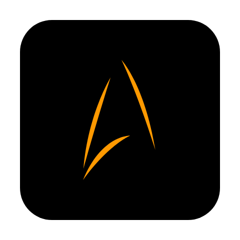
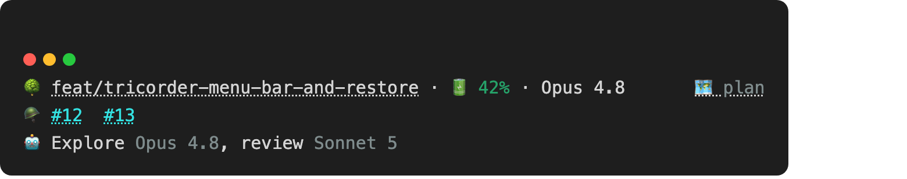
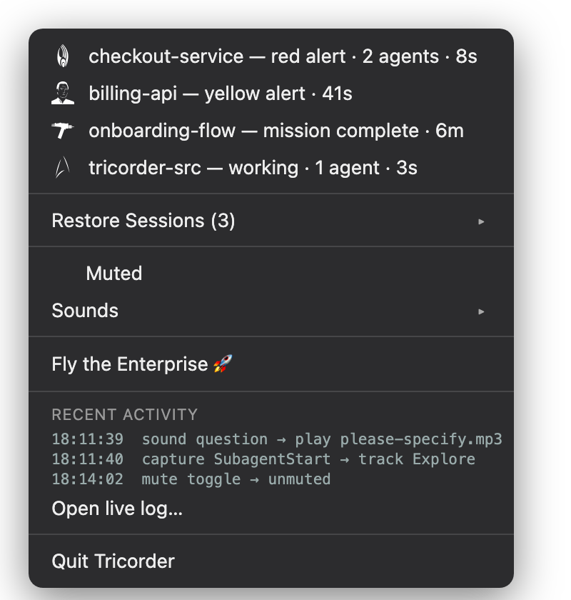

<p align="center">
  
</p>

<h1 align="center">Tricorder</h1>

<p align="center">
  <em>Full sensor sweep of your Claude Code sessions — an always-on statusline, a Starfleet away-team view in your macOS menu bar, and attention klaxons.</em>
</p>

<p align="center">
  
  
  
  
</p>

<p align="center">
  
</p>

<p align="center">
  <strong><a href="https://gagoar.github.io/tricorder/">Live site</a></strong> ·
  <a href="https://gagoar.github.io/tricorder/sounds.html">Sound catalog</a> ·
  <a href="#install">Install</a>
</p>

## What is this

Tricorder is a personal Claude Code plugin plus a native macOS menu-bar app. The
plugin renders a multi-line statusline (worktree, context gauge, model, PRs,
running sub-agents, plan link) and tags every session's attention state from
Claude Code's own hooks. The menu-bar app — `TricorderBar`, plain Swift, no
Xcode required — turns that into one glanceable icon across all your sessions,
lets you jump straight to the one that needs you, restore whole project
families after a restart, and pick your own Star Trek attention sounds from a
public catalog.

It's deeply wired to **iTerm2** by name (session focus, restore, and the
Enterprise flyby all script iTerm2 directly) and needs **Node** on `PATH` at
runtime (or the optional dependency-free build below).

## Features

- **Multi-line statusline** — worktree link, a color-graded context-window gauge, model, PR links, running sub-agents with their model, and a plan-file link. Only non-empty lines render. A one-shot mini-ship animation greets each new session.
- **Away-team menu bar** — one icon reflects the highest-priority state across every session (🔴 security, 🟡 question, 🟢 done). Click a row to focus that session's iTerm2 tab, wherever it is. A 🔊 marks whichever row's sound just played, so several "mission complete" rows aren't ambiguous about which one is current.
- **Restore Sessions** — after a crash or reboot, reopen whole project families in fresh iTerm2 windows with one click, grouped automatically by directory.
- **Attention klaxons** — four Star Trek voice/chime cues, muted by default, toggled per-event from the menu.
- **Sound catalog** — browse and preview real clips from a public archive on the [site](https://gagoar.github.io/tricorder/sounds.html), and assign one to an event with a click — fetched on demand, nothing extra bundled in this repo.
- **Fly the Enterprise** 🚀 — because you can.

## Screenshots

<p align="center"><br>
<sub>Worktree · context gauge · model — PR links — running sub-agents with model — plan link (right-aligned)</sub></p>

<p align="center"><br>
<sub>Every session, its state and age, Restore Sessions, mute/sound toggles, and a live activity tail</sub></p>

## Requirements

The statusline and the menu-bar app are **independent** — install either one alone, or both. Both need macOS.

- **Statusline**: Node on `PATH` at runtime (the shipped binary is a Node shim — or run `npm run build:sea` for a ~119MB standalone binary with no Node dependency); Claude Code with plugin support.
- **Menu-bar app**: **iTerm2** — session focus, restore, warp, and log-tail all target it by name, no fallback for other terminals; a Swift toolchain (`swiftc` — no Xcode) to build it. Needs **no** Claude Code plugin install of its own — it only shells out to the CLI binary and to iTerm2/AppleScript. It has nothing to show, though, until *some* Claude Code project has the plugin's hooks installed.

## Install

Pick the path that matches what you want. Neither needs the other. Or skip
the manual steps and run the interactive setup, which asks what you want and
defaults to both:
```
git clone https://github.com/gagoar/tricorder.git ~/.claude/tricorder-src
cd ~/.claude/tricorder-src
npm run setup
```

### Statusline only
```
/plugin marketplace add ~/.claude/tricorder-src
/plugin install tricorder@tricorder
```
This wires the `capture` and `sound` hooks automatically — they merge with any hooks you already have. Then add this once to `~/.claude/settings.json` (plugins can't contribute a `statusLine` themselves):
```json
"statusLine": {
  "type": "command",
  "command": "\"${CLAUDE_PLUGIN_ROOT}\"/bin/tricorder statusline"
}
```
That's it — no menu-bar app, no LaunchAgent, nothing else to build.

### Menu-bar app only
```
npm install
npm run build:bar
cp plugin/bar/TricorderBar.app ~/Applications/ -R
sed "s|__HOME__|$HOME|g" bar/com.gago.tricorder.bar.plist > ~/Library/LaunchAgents/com.gago.tricorder.bar.plist
launchctl load ~/Library/LaunchAgents/com.gago.tricorder.bar.plist
```
The first time it focuses a session or restores one, macOS asks permission for Tricorder to control iTerm2 — allow it. No `/plugin install` step needed for this path.

### Both (recommended)
Do the Statusline steps, then the Menu-bar app steps. This is the intended full experience and the only path that gets you nice session labels immediately (see Known limitations below).

### CLI-only, no persistent app
Sounds, mute, and restore are plain CLI commands — usable by hand or from a shell alias without ever running the menu-bar app:
```
tricorder mute toggle
tricorder sound-enable question toggle
tricorder logs
```

### Optional: dependency-free binary
```
npm run build:sea
```
Produces a self-contained binary that doesn't need Node on `PATH`. Works with either install path above — it just changes how `bin/tricorder` runs, not what depends on what.

## Configuration

Effective config lives at `~/.claude/tricorder/config.json`, seeded on first run. `muted` is `true` by default.

| Event | Default | Line |
|---|---|---|
| `question` | on | "Please specify how you would like to proceed" |
| `permission` | **off** | "Security authorisation required" |
| `stop` | on | Transporter chime |
| `plan` | on | "Engage" |

Pick a different clip for any event from the [sound catalog](https://gagoar.github.io/tricorder/sounds.html) — it fetches on demand into `~/.claude/tricorder/sounds/` and updates the config for you. Override a menu-bar icon by dropping `~/.claude/tricorder/icons/<state>.svg`.

`worktreeClick` controls what clicking the worktree link does: `open` (default, a bare `file://` link — no app needed), `copy` (copies the path to the clipboard), or `both`. `copy`/`both` need the menu-bar app running to handle the click; set it from `setup.sh`'s prompt or the app's "Worktree Link" menu.

## CLI reference

| Command | Wired to | Does |
|---|---|---|
| `statusline` | `statusLine` setting | Renders the panel |
| `capture` | hooks | Records session state |
| `sound <event>` | hooks | Plays a configured sound if not muted; stamps the session's last-sound time for the menu-bar app's 🔊 indicator |
| `sound-enable <event> [on\|off\|toggle]` | menu | Flips one sound's enabled flag |
| `sound-set <event> <url> [name]` | catalog page | Fetches a pick and assigns it to an event (trekcore.com only) |
| `mute [on\|off\|toggle]` | menu | Flips the global mute |
| `worktree-click <open\|copy\|both>` | setup / menu | Sets what clicking the worktree link does |
| `warp` | menu / URL | Flies the Enterprise |
| `status` | menu (polled) | JSON snapshot for the menu-bar app |
| `ack <id>` | menu | Clears a session's attention state |
| `logs [n\|clear]` | menu | Shows or clears the activity log |

## How it works

Claude Code hooks call `tricorder capture` on every meaningful event, which
writes tiny per-session state files under `~/.claude/tricorder/state/`.
`tricorder statusline` renders from that state plus the stdin payload Claude
Code gives it. `TricorderBar.swift` polls `tricorder status` on a 1-second
background timer and only ever reads cached results when you open the menu,
so opening it is instant no matter how much is going on.

## Known limitations

- **Sub-agent model needs the statusline, at least once.** A sub-agent's model
  is exact when its spawn set an override, or inherited from the session once
  `tricorder statusline` has rendered for it at least once — no Claude Code
  hook payload carries the session's model name, only the statusline's
  stdin payload does. Until then it shows `default`. This only affects the
  statusline's own sub-agent line; the menu-bar app never displays model, so
  running menu-bar-only is unaffected.
- **Menu-bar-only sessions get a plain label at first.** Without the
  statusline ever running, session labels and Restore Sessions group names
  come from `basename(cwd)` (e.g. `checkout-service`) rather than a branch
  name — still a real name, just less specific. The nicer label takes over
  automatically the moment the statusline renders for that session.

## Credits

- Menu-bar icons: [Star Trek Icons](https://github.com/adejong5/star-trek-icons) by Andrew DeJong, **CC BY-SA 4.0** — several sourced/scaled from The Noun Project (see [`bar/icons/ATTRIBUTION.md`](bar/icons/ATTRIBUTION.md) for per-icon credit).
- Sound catalog clips stream live from the public [trekcore.com audio archive](https://www.trekcore.com/audio/) — **no audio is bundled or redistributed by this repo**; Tricorder fetches your pick the same way clicking the link yourself would. The four default sounds shipped in `plugin/sounds/` are short fan-sourced clips included for personal, non-commercial use — replace them with your own audio if you're forking this for wider distribution.
- LCARS site styling informed by [mttaggart/lcars-css](https://github.com/mttaggart/lcars-css) and [joernweissenborn/lcars](https://github.com/joernweissenborn/lcars) (both MIT). Font: [Antonio](https://fonts.google.com/specimen/Antonio) (OFL).
- *Star Trek* and related marks are owned by CBS Studios / Paramount. This is a non-commercial personal project, not affiliated with or endorsed by them.

## License

[MIT](LICENSE) for the code. See Credits above for the icon and sound provenance, which carry their own terms.
